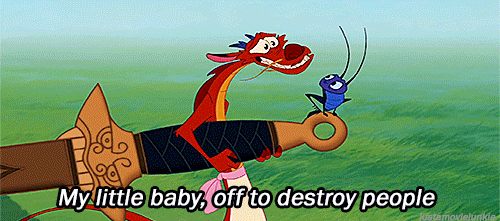

<!-- 
.. title: Interviews with FLOSS developers: Francesca Ciceri
.. slug: interviews-with-floss-developers-francesca-ciceri
.. date: 2015-03-31 21:20:58 UTC+02:00
.. tags: zou, debian, floss, geek
.. link: 
.. description: 
.. type: text
-->

_Debian and FLOSS community don't only occupy coding developers. They occupy
people who write news, who talk about FLOSS, who help on booths and
conferences, who create artistic forms of the community and so many others
that contribute in countless ways. A lady, that is doing many of that is
Francesca Ciceri, known in Debian as MadameZou. She is non-packaging Debian
Developer, a fearless warrior for diversity and a zombie fan. Although it
sounds intimidating, she is deep caring and great human being. So, what has
MadaZou to tell us?_

<!-- TEASER_END -->

**Who are you?**

My name is Francesca and I'm totally flattered by your intro. The fearless
warrior part may be a bit exaggerated, though.

**What have you done and what are you currently working on in FLOSS world?**

I've been a Debian contributor since late 2009. My journey in Debian has
touched several non-coding areas: from translation to publicity, from
videoteam to www. I've been one of the www.debian.org webmasters for a while,
a press officer for the Project as well as an editor for DPN. I've dabbled a
bit in font packaging, and nowadays I'm mostly working as a Front Desk member.

**Setup of your main machine?**

Wow, that's an intimate question! Lenovo Thinkpad, Debian testing.

**Describe your current most memorable situation as FLOSS member?**

Oh, there are a few. One awesome, tiring and very satisfying moment was during
the release of Squeeze: I was member of the publicity and the www teams at the
time, and we had to pull a 10 hours of team work to put everything in place.
It was terrible and exciting at the same time. I shudder to think at the
amount of work required from ftpmaster and release team during the release.
Another awesome moment was my first Debconf: I was so overwhelmed by the sense
of belonging in finally meeting all these people I've been worked remotely for
so long, and embarassed by my poor English skills, and overall happy for just
being there... If you are a Debian contributor I really encourage you to
participate to Debian events, be they small and local or as big as DebConf: it
really is like finally meeting family.

**Some memorable moments from Debian conferences?**

During DC11, the late nights with the "corridor cabal" in the hotel, chatting
about everything. A group expedition to watch shooting stars in the middle of
nowhere, during DC13. And a very memorable videoteam session: it was my first
time directing and everything that could go wrong, went wrong (including the
speaker deciding to take a walk outside the room, to demonstrate something,
out of the cameras range). It was a disaster, but also fun: at the end of it,
all the video crew was literally in stitches. But there are many awesome
moments, almost too many to recall. Each conference is precious on that
regard: for me the socializing part is extremely important, it's what cements
relationships and help remote work go smoothly, and gives you motivation to
volunteer in tasks that sometimes are not exactly fun.

**You are known as Front Desk member for DebConf's - what work does it occupy and why do you enjoy doing it?**

I'm not really a member of the team: just one of Nattie's minions!

**You had been also part of DebConf Video team - care to share insights into video team work and benefits it provides to Debian Project?**

The video team work is extremely important: it makes possible for people not
attending to follow the conference, providing both live streaming and
recording of all talks. I may be biased, but I think that DebConf video
coverage and the high quality of the final recordings are unrivaled among
FLOSS conferences - especially since it's all volunteer work and most of us
aren't professional in the field. During the conference we take shifts in
filming the various talks - for each talk we need approximately 4 volunteers:
two camera operators, a sound mixer and the director. After the recording,
comes the boring part: reviewing, cutting and sometimes editing the videos.
It's a long process and during the conference, you can sometimes spot the
videoteam members doing it at night in the hacklab, exhausted after a full day
of filming. And then, the videos are finally ready to be uploaded, for your
viewing pleasure. During the last years this process has become faster thanks
to the commitment of many volunteers, so that now you have to wait only few
days, sometimes a week, after the end of the conference to be able to watch
the videos. I personally love to contribute to the videoteam: you get to play
with all that awesome gear and you actually make a difference for all the
people who cannot attend in person.

**You are also non-packaging Debian Developer - how does that feel like?**

Feels awesome! The mere fact that the Debian Project decided - in 2009 via a
GR - to recognize the many volunteers who contribute without doing packaging
work is a great show of inclusiveness, in my opinion. In a big project like
Debian just packaging software is not enough: the final result relies heavily
on translators, sysadmins, webmasters, publicity people, event organizers and
volunteers, graphic artists, etc. It's only fair that these contributions are
deemed as valuable as the packaging, and to give an official status to those
people. I was one of the firsts non-uploading DD, four years ago, and for a
long time it was just really an handful of us. In the last year I've seen many
others applying for the role and that makes me really happy: it means that
finally the contributors have realized that they _deserve_ to be an official
part of Debian and to have "citizenship rights" in the project.

**You were the leading energy on Debian's diversity statement - what gave you the energy to drive into it?**

It seemed the logical conclusion of the extremely important work that Debian
Women had done in the past. When I first joined Debian, in 2009, as a
contributor, I was really surprised to find a friendly community and to not be
discriminated on account of my gender or my lack of coding skills. I may have
been just lucky, landing in particularly friendly teams, but my impression is
that the project has been slowly but unequivocally changed by the work of
Debian Women, who raised first the need for inclusiveness and the awareness
about the gender problem in Debian. I don't remember exactly how I stumbled
upon the fact that Debian didn't have a Diversity Statement, but at first I
was very surprised by it. I asked zack (Stefano Zacchiroli), who was DPL at
the time, and he encouraged me to start a public discussion about it, sending
out a draft - and helped me all the way along the process. It took some back
and forth in the debian-project mailing list, but the only thing needed was
actually just someone to start the process and try to poke the discussion when
it stalled - the main blocker was actually about the wording of the statement.
I learned a great deal from that experience, and I think it changed completely
my approach in things like online discussions and general communication within
the project. At the end of the day, what I took from that is a deep respect
for who participated and the realization that constructive criticism does
require certainly a lot of work for all parts involved, but can happen. As for
the statement in itself: these things are as good as you keep them alive with
best practices, but I think that are better stated explicitly rather than
being left unsaid.

**You are involved also with another Front Desk, the Debian's one which is involved with Debian's New Members process - what are tasks of that FD and how rewarding is the work on it?**

The Debian Front Desk is the team that runs the New Members process: we
receive the applications, we assign the applicant a manager, and we verify the
final report. In the last years the workflow has been simplified a lot by the
re-design of the nm.debian.org website, but it's important to keep things
running smoothly so that applicants don't have too lenghty processes or to
wait too much before being assigned a manager. I've been doing it for a less
more than a month, but it's really satisfying to usher people toward DDship!
So this is how I feel everytime I send a report over to DAM for an applicant
to be accepted as new Debian Developer:

**How do you see future of Debian development?**

Difficult to say. What I can say is that I'm pretty sure that, whatever the
technical direction we'll take, Debian will remain focused on excellence and
freedom.

**What are your future plans in Debian, what would you like to work on?**

Definetely bug wrangling: it's one of the thing I do best and I've not had a
chance to do that extensively for Debian yet.

**Why should developers and users join Debian community? What makes Debian a great and happy place?**

We are awesome, that's why. We are strongly committed to our Social Contract
and to users freedom, we are steadily improving our communication style and
trying to be as inclusive as possible. Most of the people I know in Debian are
perfectionists and outright brilliant in what they do. Joining Debian means
working hard on something you believe, identifying with a whole project,
meeting lots of wonderful people and learning new things. It ca be at times
frustrating and exhausting, but it's totally worth it.

**You have been involved in Mozilla as part of OPW - care to share insights into Mozilla, what have you done and compare it to Debian?**

That has been a very good experience: it meant have the chance to peek into
another community, learn about their tools and workflow and contribute in
different ways. I was an intern for the Firefox QA team and their work span
from setting up specific test and automated checks on the three version of
Firefox (Stable, Aurora, Nightly) to general bug triaging. My main job was bug
wrangling and I loved the fact that I was a sort of intermediary between
developers and users, someone who spoke both languages and could help them
work together. As for the comparison, Mozilla is surely more diverse than
Debian: both in contributors and users. I'm not only talking demographic,
here, but also what tools and systems are used, what kind of skills people
have, etc. That meant reach some compromises with myself over little things:
like having to install a proprietary tool used for the team meetings (and
getting crazy in order to make it work with Debian) or communicating more on
IRC than on mailing lists. But those are pretty much the challenges you have
to face whenever you go out of your comfort zone .

**You are also volunteer of the Organization for Transformative Works - what is it, what work do you do and care to share some interesting stuff?**

[OTW](http://www.transformativeworks.org/our-projects) is a non profit
organization to preserve fan history and cultures, created by fans. Its work
range from legal advocacy and lobbying for fair use and copyright related
issues, developing and maintaining AO3 -- a huge [fanwork
archive](http://archiveofourown.org/) based on open-source software --, to the
production of a peer-reviewed academic journal about fanworks. I'm an avid
fanfiction reader and writer, and joining the OTW volunteers seemed a good way
to give back to the community - in true Debian fashion . As a volunteer, I
work for the Translation Committee: we are more than a hundred people -
divided in several language teams - translating the OTW website, the interface
of AO3 archive, newsletter, announcements and news posts. We have a orga-wide
diversity statement, training for recruits, an ever growing set of procedures
to smooth our workflow, monthly meetings and movie nights. It's an awesome
group to work with. I'm deeply invested in this kind of work: both for the
awesomeness of OTW people and for the big role that fandom and fanworks have
in my life. What I find amazing is that the same concept we - as in the FLOSS
ecosystem - apply to software can be applied to cultural production: taking a
piece of art you love and expand, remix, explore it. Just for the fun of it.
Protect and encourage the right to play in this cultural sandbox is IMO
essential for our society. Most of the participants in the fandom come from
marginalised group or minorities whose point of view is usually not part of
the mainstream narratives. This makes the act of writing, remixing and re-
interpreting a story not only a creative exercise but a revolutionary one. As
Elizabeth Minkel says: ["My preferred explanation is the idea that the vast
majority of what we watch is from the male perspective – authored, directed,
and filmed by men, and mostly straight white men at that. Fan fiction gives
women and other marginalised groups the chance to subvert that perspective, to
fracture a story and recast it in her own
way."](http://www.newstatesman.com/culture/2014/10/why-it-doesn-t-matter-what-
benedict-cumberbatch-thinks-sherlock-fan-fiction) In other words, ["fandom is
about putting debate and conversation back into an artistic
process"](http://ifeelbetterer.tumblr.com/post/54202921785/a-word-about-
fandom).

**On a personal side - you do a lot of DIY, handmade works. What have you done, what joy does it bring to you and share with us a picture of it?**

I like to think that the hacker in me morphs in a maker whenever I can
actually manipulate stuff. The urge to explore ways of doing things, of create
and change is probably the same. I've been blessed with curiousity and
craftiness and I love to learn new DIY techniques: I cannot describe it,
really, but if I don't make something for a while I actually feel antsy. I
need to create stuff. Nowadays, I'm mostly designing and sewing clothes -
preferably reproductions of dresses from the 40s and the 50s - and I'm trying
to make a living of that. It's a nice challenge: there's a lot of research
involved, as I always try to be historically accurate in design, sewing
tecniques and material, and many hours of careful attention to details. I'm
right in the process of make photoshoots for most of my period stuff, so I'll
share with you something different: a t-shirt refashion done with the
DebConf11 t-shirt! (here's the
[tutorial](http://blog.zouish.org/posts/tshirt_surgery/))

