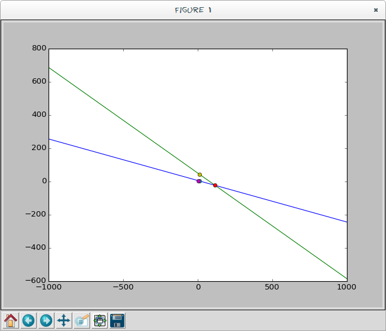

<!-- 
.. title: Lets plot some lines
.. slug: lets-plot-some-lines
.. date: 2015-01-26 20:58:45 UTC+02:00
.. tags: python, lines, math
.. link: 
.. description: 
.. type: text
-->

I have a simple faculty project where two lines intersect. To be more precise:
first line is defined by two points, second line is defined by point and
angle, all must be shown in plot presentation, given points should be marked
with "x" and intersection of two lines should also be marked with "x". I was
supposed to do it in Visual Basic but as I use only Debian - its a bummer. So
I choose to do it in Python. Lets get it started. Open your text editor.

<!-- TEASER_END -->

First I imported math, matplotlib and numpy. After that I defined a range from
where to where lines can be drawn. I choose -1000, 1000.

    
    
    import math
    import matplotlib.pyplot as plt
    import numpy as np
    x = np.arrange(-1000, 1000, 0.1)
    

Now we start getting input from users. For the first line we can have two
points. Point is defined with two coordinates x and y. Line is defined as y =
m*x + n. I am not going into analyzing what it means as you should know that
or go and duckduck some mathematics ;). For simple understanding m is tangent
of angle (in radians) and n is the y-intercept. Also I will use float for the
input as otherwise my graph could easilly show bugs because of calculations I
am going to use.

    
    
    x1 = float(input("Unesi koordinatu x1:"))
    y1 = float(input("Unesi koordinati y1:"))
    x2 = float(input("Unesi koordinatu x2:"))
    y2 = float(input("Unesi koordinatu y2:"))
    m1 = (y2-y1)/(x2-x1)
    print (m1)
    n1 = y1 - m1*x1
    print (n1)
    n3 = y2 - m1*x2
    print (n3)
    x3 = float(input("Unesi koordinatu x3:"))
    y3 = float(input("Unesi koordinatu y3:"))
    angle = float(input("Unesi ugao:"))
    m2 = math.tan(angle)
    print (m2)
    n2 = y3 - m2*x3
    print (n2)
    

Now we have all parameters for both lines. Next part is to create equation of
both lines so we can use that for plot.

    
    
    z1 = x*m1 + n1
    z2 = x*m2 + n2
    

That's it. And the last part before plotting is to find coordinates of
intersection. You get an intersection coordinates when you do P1 = P2 (P1, P2
equation of two lines) and then calculate x and y coordinate for it.

    
    
    p1 = (n2 - n1)/(m1 - m2)
    p2 = p1*m1 + n1
    

Now we are ready for the plot. Don't forget the 'x' marks - I did change this
to use "o" marks because it looks better.

    
    
    plt.plot(x, z1)
    plt.plot(x, z2)
    plt.plot(p1, p2, 'x')
    plt.plot(x1, y1, 'x')
    plt.plot(x2, y2, 'x')
    plt.plot(x3, y3, 'x')
    plt.show()
    

Save the file as twolines.py and run it in terminal python3 twolines.py. After
inputs you should get Tkinter window opened with the plot:

This is aimed to help students of Faculty of Mechanical Engineering in Banja
Luka but can be useful for others. Of course they need to build different
projects and with Visual Basic but this is good reference point to get into
thinking what do you need and how to achieve that.

Of course code can be optimized a bit but that's not the point here. Also as I
suck at building GUI I could use advice for building a proper/nice GUI under
Linux (Glade, Qt, Tkinter?) with some nice tutorials if possible.

> There's something the technicians need to learn from the artists. If it
isn't aesthetically pleasing, it's probably wrong.

If you have properly installed Python on Windows machine (with needed
libraries) you should have no problem running this code. Same for Mac users.

I didn't go without any stupid errors during the writing of this code so I
developed a state-of-the-art Python debugger. At first I wanted to keep it
closed source and sell it for $1000 where people would be happy for what they
gave their money and would thank me every day for it but I am a Free software
person. Its still not published but here is the preview of its awesome AI
capabilities:

    
    
    $ dbg foo
    Write damn print statements for your debugging, stupid!
    

I know! Its awesome! I called it Super Awesome Zlatan's Python Debugger With
AI Power or shortly SAZPDWAP.

* * *

For getting in touch with me or to get source code of my debugger please mail
me.
