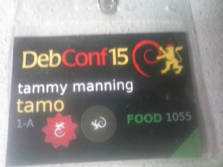

<!-- 
.. title: The big life adventure called DebConf15
.. slug: the-big-life-adventure-called-debconf15
.. date: 2015-08-28 12:38:12 UTC+02:00
.. tags: debconf15, debian, life
.. category: 
.. link: 
.. description: 
.. type: text
-->

By the help of sponsorship I managed again to attend the conference where Debian family gathers. This is going to be a mix without any particular order of everything, anything and nothing else ;)

I arrived to Heidelberg Main Train Station around 9am on 15th August and almost right away found Debian people so it made my trip to hostel easier. After arrival I checked in but needed to wait for 3 hours to get the key (it seems that SA will not have that problem at all, which is already an improvement). Although waiting was 3 hours long, it wasn't actually difficult at all as I started hugging and saying hi to many old (the super old super friend of mine - moray, or how I call him, "doc") and new friends. I just must say - if you know or don't know Rhonda, try to get somehow into her hugs. With her hug I acknowledged that I really did arrive to reunion.

<!-- TEASER_END -->

To praise right away, that the diversity outreach - it really nailed it. People behind this idea deserve a medal, because it made DebConf so much more colorful, so much more exciting and talking to newcomers was awesome because they were super excited and want to hop on our train ASAP. It made Debian even more perfect mix! KUDOS!

So first day I caught some talks (with friends and the scheduled ones), helped organizing the Debian birthday cake (and yet Tassia didn't arrange me a stuff t-shirt, that is a bad DebConf chair ;) ) and got a fairly decent amount of wheat beer. The fun part of night ended up by the bar, singing ex-Yugoslav rock songs with Milan and Adnad. I went really late to my room, started crawling into my bed when suddenly I noticed someone was already there. A dude. Okay, late night, some quantity of beers and dude in my bed - yep, DebConf started. :D (the dude is a DD (pronounce it yourself as you like)).

Next day (if I am not mistaking, but part of memories are shady) I met (again) an Aussie, and he didn't recognize me (as many others from DebConf Portland) because I now don't have the big beard. I remembered him by the small accident that happened in Portland (no, not a cheeky accident ;) ). In next few days him, Eric (Canadian DD working for Google) and me, were quite a team and doing a lot of fun stuff together (karaoke, table tennis, football, beer, beer, jokes, technical discussions, beer). That is how good friendships are born.

I think this was the first night with karaoke (yep the famous night). Let's say that it was a great night (I never did karaoke before in my life, and I was so ready to embarrass myself and I think I did a good job at that :D ) and wk was the central figure of night (also that was the night/morning Tincho arrived). Meeting Werner Koch was a real privilege to me, and getting him to know in person actually made him much bigger in my eyes. Thank you for GPG and thank for good company during DebConf.

To add a bit on outreach part - I met a girl from Kenya and she is a very interesting person. I don't know much about Africa when it comes to Linux but I was really glad to see her eagerness to give back to Debian. She loved the conference and I gladly showed her basics of Debian packaging, on her request. On personal side, she shared some stories of Kenya which will make me think twice if I want to drink in some parts of that country (running naked on beaches still seems to be fine). :D I met also quite a number of people interacting with Debian community for the first time, and I have the feeling that big part of that will stay and integrate very well with us.

##Wine and Cheese

So there was this ceremony called Wine and Cheese Party (isn't it obvious that French invented it) on which we bring - hard to believe, but wine and cheese from our region. And this happens over a decade already. And yes, people bring other things then wine and cheese (for example some guy brought this year on W&C 2.5l of rakija, but there are also whiskey, vodka, beer and so on). I hope hostel people were happy with the smell of cheese mixed with alcohol. To me it seemed they enjoyed. During W&C I met quite an interesting number of people, from which one Spanish girl that lives in Italy (if I got that correctly) stood out that night. Sadly I didn't interact much with her during the conference as there were so much interesting things for me to do and I just floated from one to other (yep, didn't get much of sleep at all ;) ). Lets hope someone clever suggests a DebConf that will last for a month (two?).

##Serbian colony

Although I enjoy improving English on DebConf I also like that I can hear Spanish, Italian, French, Chinese, German and other languages, and I do sometimes have a need to speak in my native language. Besides having Milan on all DebConfs (on which I also were) this year we got 3 more people (they seem to be also in Banja Luka, but of course that was easy to miss for me). It seems that they really liked our community and are in process to activate themselves and start integrating (isn't this word so cool!). Btw, Milan was honored to become DD during DebConf (not sure did he got yet account but that is few mails away). Congratulation Milan!

##paultag and others

My life is going through worst hellstorm of my life at this point (rendering me almost uncapable of coming to DebConf) but how Debian people can throw energy into me is for me a thing I will never ever be able to explain. From sitting on grass with Jonas and Siri, through hanging around with Eric and Joel, to mixing with groups of people doing fun things (drunc-tank, really?!). But one stood out of all - although it was W&C, and he enjoyed quite a bit of rakija, paultag said to me something in these lines: "I love you man much more now. I mean I already loved you Zlatan, but now I love you even more". So dude, Paul snowman Tagliamonte - I love you man in same strength! Thanks for that awesome words you drunk bastard! <3

##Thanks for the beer, thanks for you

So, while, I'll give my kudos to hostel people later on, I must admit that one girl from bar (and everyone knows which one) - made my "hellstorm" much easier to keep on the fighting (still very hard for me) and it's not because of beer. We get to know each other a lot in really short time. We talked, and shared openly a lot of ideas. In the spirit of Debian community. Indeed everything is better to do openly and to share with someone. Thanks Anna for just being there. Also, Anna really loved our community and all the crazy people running around, she got T-shirt for her father and she is going to install Debian very soon and wants to contribute back to community. Debian - you are doing it well!

##maddog

To continue with people that made really good impact on me, or made at least my time much better on DebConf15. In both categories fits maddog. Although we only had one conversation for 3 hours, I indeed learned a lot from him about the history and probably future of IT, but also to get know a person who truly has astonished life and fresh way of thinking. Maddog, it was more then pleasure to meet you, hope our path cross more often in future.

##ah, mbiebl, hug, gaudenz, abe

So I met again ah, a person which I admire work in Debian but on the same level I admire his personality. He seems to be floating on the same waves as I do, or at least that is the impression (he will neglect if I lie ;) ). Also I finally met one of my long-time Debian champions. A Debian wizard. Michael Biebl. He was always super cool to me on IRC, and I lurk his work for years already. In real life - I must say that he is the only person that my IRC experience combined with imagination how person would look like, fits perfectly. Yep, I admire him on the same level as vorlon, joeyh, bdale and many others.

One of the people I was probably most often asking for his arrival, was hug. And he did arrive at the end of conference (bad hug, next time do it better). Had a pleasant time with him, pleasant conversation and more paved road for future friendship. The same goes for gaudenz and abe. Just seeing you guys makes my DebConf experience much better. Thanks for being there and being you.

##joeyh

Speaking of Joey Hess, we made few talks and bets about him. My bet is that he misses us a lot and that he will return back to Debian soon (relativity) and be or on DebConf16 already or the latest date I set was DebConf17. Yeah, Joey, we all know you will return home at some point, there is so much work for you to do here - I also hope you get more vocal so our community can improve much better. :)

##Kids

This was the first DebConf having organized childcare. And besides *ULTRA MEGA BIG KUDOS* I must say that it felt so naturally that I wonder how that wasn't there from start. I was very happy to met again my most loved couple alphascorpii and Tolimar and to acknowledge that they forked even more new DDs. Yep, I am really starting to think about that more. You know, for the sake of Debian. Also kudos to Teckids!

##Karaoke nights

Just a quick thought on this. Karaoke and dancing nights - brilliant, should be part of DebConf tradition for sure (of course that probably means I should never ever sing again, but that wouldn't be hard for me accept).

##Now some community sadness

Okay, keithp was not on DebConf. We will blame Bdale for that (yes keithp, he was happily telling us the story, that's why you should next year be faster!). Russ - I think you really were busy with work, but next year that will not be the excuse anymore. We love you still, but you must stop breaking our hearts with missing our social life! Apoikos had home moving, but man you and costas were really missed. Hope to see you soon! But there are two guys that deserve to be angry on - mako and gismo. No, sorry, you have zero/nada/0/no excuses for not coming to DebConf15! I hope you redeem yourself and come to DebConf16 and dance naked while singing karaoke! I think community would agree that this would be enough to forgive you. For now.

#The Machine

Speaking of Bdale (if newcomers missed him, he is a big Debian oldtimer, with strange colorful shirts) he was talking with us about The Machine (the new HP super-tech that will have first preview of their early iteration in summer 2016). Although you can go and read all what he said on web (already for sometime), it was actually really interesting to see him explain all that and the excitement in his voice and eyes. I can imagine that with his abundant experience in tech world for decades, hardly anything can excite him but this indeed does a lot. And The Machine will run hLinux (HP iteration of Debian). He also shared us happy news that keithp seems to be very happy with his new work and that makes us all much happier community likewise.

##Dogging

Yep, I luckily found about this on DebConf, otherwise I would really get into some wild things in my life if someone randomly asked me about dogging and had their dog with themselves. If you want to know more watch [this video](http://ftp.acc.umu.se/pub/debian-meetings/2015/debconf15/Enricos_semi_serious_stand_up_comedy.webm).

##Day trip

My choice of Debian DayTrip was Speyer Tech Museum. This can be very well a feedback. Tech Museum was the most beautiful one of its kind I ever visited in my entire life. I want to live in that museum and drive all the cars and listen to all the music. On the other hand, having 6-7 hours for it was way too much for me (and it seems for the most people too). I was very tired so I spent most of my time waiting for the buses to take us "home". I only wish Ganneff "made" me earlier go to slide, so I could spend my time having fun. There was another museum in nearby city which visiting would make more sense then being for so long on one place.

##Debian dinner

This can be taken as feedback for our organizer and for restaurant. The location of restaurant and sight was wonderful. The food was delicious, the desert was perfect and restaurant personnel were kind. It was really great but it could have been much better. For the restaurant: food portions were just too small for majority of people. Also they should have numbering of the tables so for example: if they have 100 tables and 20 personnel, they number the tables from 1 to 100 and each personnel gets 5 tables (first one first five and so on) because there were people that have ate their food 20mins before some even got their. That is way too much of delay. Other then that - it was a real pleasure to be there. For our organizers: I think that people don't expect to be on dinner with jackets or much warmer clothes so either plan closed restaurant or make Debian Launch (so it happens during warmer time of the day, this should be taken into account for all future DebConf organizers). People got cold and many left (including me) very early. Debian Picnick would be an awesome tradition to add into calendar.

##We have beaten KDE community

Oh yes we [did](http://pusling.com/blog/?p=390). So what would be a calm night (yeah right) has turned into color festival thanks to tireless and incredible Valerie (yea, we all love her - there aren't much ladies that can undress dozen of men without almost any effort). So we got dyeing their hair and chest (some all, some swirl). This was so great that now there are suggestions of tattoo and piercing session on DebConf in SA. WHY NOT?!

##Tag exchanging

So someone got an idea of tag exchanging for last few days. I ended up with tammy manning aka tamo. 

I don't recall meeting tammy, so if you could send your pic to me, that would be really cool. Also I am eager to know who ended up with my tag! :)

##Hostel personnel

People at hostel have done their job so good that not even for one moment I thought about them any different then from our community. They blended in so smoothly like they are for years with us. I think that is beyond kudos to them. We can only wish to have such hosts in future and I certainly hope we will host more Debian events there. Big thanks for them and keeping the insane pace with us. You deserve a medal!

##DebConf organizers

Of course this is personal POV, but this DebConf has blown away all previous DebConf's by a clear margin. Not only it had highest number of people attending, it had the highest diversity ever which made DebConf so much better, it had childcare for the first time and it was really planned to last detail (wouldn't expect anything less from Germans :) ). There are no words that can say enough thank you for all involved in organization. You set new high standards for DebConf, paved the road for future of it and I am very sure made an yet to be acknowledged impact on future of entire Debian ecosystem. This DebConf will shine forever and mark the history of Debian as a project. By not minimizing the extraordinary effort of all, I want to add special thanks to madduck who, by his own fault, have taken the biggest share of load - man, I am really glad in the end that you have been enough stubborn to pull the energy out of you and make the conference run almost at perfect pace. You were THE GEAR that was pushing this organization forward. Thanks a lot for that!

##Bits about me on DebConf15

So I had caught most of my mail backlog during DebConf and I thought I replied to my NM process mail (which I found out that I didn't because mail was never sent probably due to loosing network connectivity but fortunate most of it was in drafts). I was looking forward to job fair (because although paultag loves his unemployment period of life, I had a bit too much of it) and had a good talk with people from BMW but as my screen died on me (just after I thought I sent reply to NM) I didn't apply and coming home I found out that position seems to be already taken. Also I didn't do much of the hacking because my planned days were day after screen went to other side. Speaking of job hunting, yes, I am now on fire round to find one so if you know and or have a position for me (I am very good at trolling, is there such a job? ;) ) please do let me know. I'll post more about my job hunting in next post so people can see my cry for it :)
